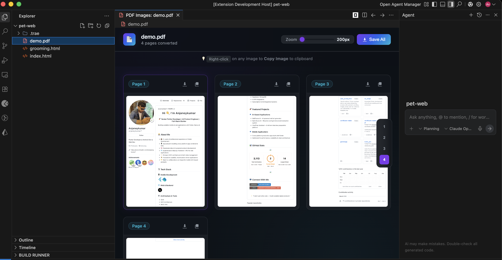

# PDF to Images — VS Code Extension

<p align="center">
  
</p>

<p align="center">
  <strong>Open any PDF in VS Code as a beautiful image gallery.</strong><br>
  Copy, zoom, navigate, and save — without leaving your editor.
</p>

<p align="center">
  <a href="https://marketplace.visualstudio.com/items?itemName=anjaneykumar7.pdf2img">
    
  </a>
  <a href="https://marketplace.visualstudio.com/items?itemName=anjaneykumar7.pdf2img">
    
  </a>
  
</p>

---

## ✨ Features

| Feature                   | Description                                              |
| ------------------------- | -------------------------------------------------------- |
| 🖼️ **Gallery View**       | PDF pages displayed as a responsive image grid           |
| 📋 **Right-Click Copy**   | Copy any page as an image to your clipboard instantly    |
| 🔍 **Zoom Controls**      | Scale from 50% up to 300% with crisp rendering           |
| 🧭 **Page Navigation**    | Jump to any page in large multi-page documents           |
| 📄 **Native PDF Support** | Click any `.pdf` file — opens as a gallery automatically |
| 💾 **Save as Image**      | Export individual pages as high-quality PNG files        |

## 🚀 Getting Started

### Install

1. Open **VS Code**
2. Go to the Extensions panel (`Ctrl+Shift+X` / `Cmd+Shift+X`)
3. Search for **"PDF to Images"**
4. Click **Install**

Or install directly from the [VS Code Marketplace](https://marketplace.visualstudio.com/items?itemName=anjaneykumar7.pdf2img).

### Usage

- **Open a PDF** — Click any `.pdf` file in your workspace. It opens as an image gallery by default.
- **Right-click to copy** — Right-click any page thumbnail → **Copy Image**.
- **Zoom** — Use the zoom slider or `+` / `-` buttons in the toolbar.
- **Navigate** — Use page input or arrow buttons to jump between pages.
- **Context menu** — Right-click a `.pdf` in the Explorer sidebar → **PDF to Images: Convert PDF**.

## 🛠️ Commands

| Command                      | Description                               |
| ---------------------------- | ----------------------------------------- |
| `PDF to Images: Convert PDF` | Open a PDF file as an image gallery       |
| `Copy Image`                 | Copy the selected page image to clipboard |

## 📦 Tech Stack

- **TypeScript** — Extension logic
- **pdfjs-dist** — PDF rendering engine
- **esbuild** — Bundler
- **VS Code Custom Editor API** — Native `.pdf` file association

## 🏗️ Development

```bash
# Clone the repo
git clone https://github.com/anjaneykumar7/pdf2img.git
cd pdf2img

# Install dependencies
npm install

# Start dev mode (watches for changes)
npm run watch

# Build for production
npm run build
```

Press `F5` in VS Code to launch the Extension Development Host.

## 📄 License

MIT © [anjaneykumar7](https://github.com/anjaneykumar7)
